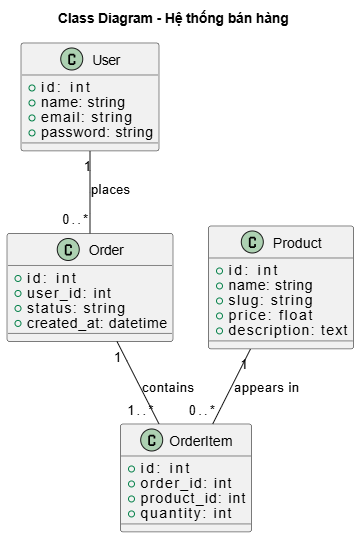
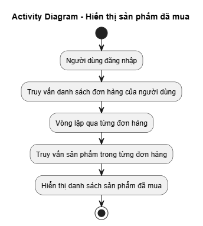
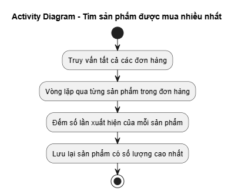

<p align="center"><a href="https://laravel.com" target="_blank"></a></p>

<p align="center">
<a href="https://github.com/laravel/framework/actions"></a>
<a href="https://packagist.org/packages/laravel/framework"></a>
<a href="https://packagist.org/packages/laravel/framework"></a>
<a href="https://packagist.org/packages/laravel/framework"></a>
</p>

# DemoWeb - Laravel Project

## 👤 Thông tin sinh viên

- **Họ tên:** Phạm Anh Thái 
- **Mã sinh viên:** 23010784

---

## 📌 Giới thiệu Project

**DemoWeb** là một dự án web bán hàng đơn giản được xây dựng bằng Laravel.  
Ứng dụng hỗ trợ người dùng xem sản phẩm, đặt hàng, quản lý đơn hàng cá nhân và cho phép admin quản lý toàn bộ hệ thống.

---
✅ Chức năng của User (người dùng bình thường)
⚙️ Truy cập công khai (không cần đăng nhập):
GET /products: Xem danh sách sản phẩm.

GET /products/{product:slug}: Xem chi tiết sản phẩm.

🔐 Sau khi đăng nhập:
GET /dashboard: Chuyển hướng về trang danh sách sản phẩm.

GET /profile: Xem trang chỉnh sửa hồ sơ.

PATCH /profile: Cập nhật thông tin hồ sơ.

DELETE /profile: Xoá tài khoản.

📦 Đặt hàng:
GET /orders: Xem danh sách đơn hàng của mình.

POST /orders: Tạo đơn hàng mới.

GET /orders/{order}: Xem chi tiết đơn hàng.

👑 Chức năng của Admin (quản trị viên)
Tất cả các route admin đều dùng tiền tố /admin và cần có middleware auth + admin.

📊 Dashboard:
GET /admin: Truy cập trang dashboard chính của admin.

🛒 Quản lý sản phẩm:
CRUD tại /admin/products: tạo, xem, sửa, xoá sản phẩm.

🧩 Quản lý danh mục:
CRUD tại /admin/categories: quản lý các loại sản phẩm.

📦 Quản lý đơn hàng:
CRUD tại /admin/orders: xem và xử lý đơn hàng.

👥 Quản lý người dùng:
CRUD tại /admin/users: quản lý tài khoản người dùng.

🔐 Bảo mật (Security)
Dự án đã áp dụng một số biện pháp bảo mật cơ bản trong Laravel:

1. Xác thực (Authentication)
Sử dụng Laravel Breeze để cung cấp tính năng đăng ký, đăng nhập, xác thực email.

Mọi route yêu cầu người dùng phải đăng nhập đều được bảo vệ bởi middleware auth.

2. Phân quyền (Authorization)
Admin và User được phân biệt thông qua middleware admin.

Các route dành riêng cho quản trị viên (/admin) yêu cầu có quyền admin.

3. Bảo vệ CSRF
Laravel tự động thêm token CSRF vào các form để ngăn chặn tấn công Cross-Site Request Forgery.

4. Mã hóa mật khẩu
Mật khẩu người dùng được mã hóa bằng bcrypt thông qua Laravel Auth.

5. Validation dữ liệu đầu vào
Các request từ người dùng đều được xác thực bằng Form Request Validation để đảm bảo tính đúng đắn và an toàn.

6. Tối ưu hóa truy cập database
Sử dụng Eloquent ORM với kỹ thuật eager loading giúp tránh lỗi N+1 query.
## 🧱 Sơ đồ cấu trúc (Class Diagram)


## 🧱 Sơ đồ thuật toán  (Activity Diagram)

🛍️ Hiển thị tất cả sản phẩm được mua bởi khách hàng:



📊 Tìm kiếm sản phẩm được chọn nhiều nhất:



## Code minh họa
### 1.Model products và các mối quan hệ phức tạp
*File: `app/Models/Product.php`*
```php
public function category()
    {
        return $this->belongsTo(Category::class);
    }

    /**
     * Get order items for this product
     */
    public function orderItems()
    {
        return $this->hasMany(OrderItem::class);
    }
```
### 2.CRUD cho Products
*File: `app/Http/Controllers/ProductController.php`*
```php
public function index(Request $request)
    {
        $query = Product::with('category')->where('stock', '>', 0);

        // Search by name or description
        if ($request->filled('search')) {
            $query->where(function($q) use ($request) {
                $q->where('name', 'like', '%' . $request->search . '%')
                  ->orWhere('description', 'like', '%' . $request->search . '%');
            });
        }

        // Filter by category
        if ($request->filled('category')) {
            $query->where('category_id', $request->category);
        }

        // Sorting
        $sortable = ['name', 'price', 'created_at'];
        $sortBy = $request->get('sort_by', 'created_at');
        $sortOrder = $request->get('sort_order', 'desc');
        if (!in_array($sortBy, $sortable)) {
            $sortBy = 'created_at';
        }
        if (!in_array($sortOrder, ['asc', 'desc'])) {
            $sortOrder = 'desc';
        }
        $query->orderBy($sortBy, $sortOrder);

        $products = $query->paginate(12)->appends($request->except('page'));
        $categories = Category::all();

        return view('products.index', [
            'products' => $products,
            'categories' => $categories,
            'search' => $request->search,
            'categorySelected' => $request->category,
            'sortBy' => $sortBy,
            'sortOrder' => $sortOrder,
        ]);
    }
```
### 3. Giao diện CRUD cho Product
*File:`resources/views/admin/products/index.blade.php`*
```php
@extends('admin.layouts.app')

@section('content')
<div class="bg-white overflow-hidden shadow-sm sm:rounded-lg">
    <div class="p-6 text-gray-900">
        <h1 class="text-2xl font-bold mb-6">Dashboard - Quản lý sản phẩm</h1>

        <!-- Stats Cards -->
        <div class="grid grid-cols-1 md:grid-cols-2 lg:grid-cols-4 gap-6 mb-8">
            <div class="bg-blue-500 text-white rounded-lg p-6">
                <div class="flex items-center">
                    <div class="p-3 rounded-full bg-blue-600">
                        <svg class="w-6 h-6" fill="none" stroke="currentColor" viewBox="0 0 24 24">
                            <path stroke-linecap="round" stroke-linejoin="round" stroke-width="2" d="M20 7l-8-4-8 4m16 0l-8 4m8-4v10l-8 4m0-10L4 7m8 4v10M4 7v10l8 4"></path>
                        </svg>
                    </div>
                    <div class="ml-4">
                        <p class="text-sm font-medium">Tổng sản phẩm</p>
                        <p class="text-2xl font-bold">{{ $stats['total_products'] }}</p>
                    </div>
                </div>
            </div>
            <div class="bg-green-500 text-white rounded-lg p-6">
                <div class="flex items-center">
                    <div class="p-3 rounded-full bg-green-600">
                        <svg class="w-6 h-6" fill="none" stroke="currentColor" viewBox="0 0 24 24">
                            <path stroke-linecap="round" stroke-linejoin="round" stroke-width="2" d="M9 12h6m-6 4h6m2 5H7a2 2 0 01-2-2V5a2 2 0 012-2h5.586a1 1 0 01.707.293l5.414 5.414a1 1 0 01.293.707V19a2 2 0 01-2 2z"></path>
                        </svg>
                    </div>
                    <div class="ml-4">
                        <p class="text-sm font-medium">Tổng đơn hàng</p>
                        <p class="text-2xl font-bold">{{ $stats['total_orders'] }}</p>
                    </div>
                </div>
            </div>
            <div class="bg-yellow-500 text-white rounded-lg p-6">
                <div class="flex items-center">
                    <div class="p-3 rounded-full bg-yellow-600">
                        <svg class="w-6 h-6" fill="none" stroke="currentColor" viewBox="0 0 24 24">
                            <path stroke-linecap="round" stroke-linejoin="round" stroke-width="2" d="M12 4.354a4 4 0 110 5.292M15 21H3v-1a6 6 0 0112 0v1zm0 0h6v-1a6 6 0 00-9-5.197m13.5-9a2.5 2.5 0 11-5 0 2.5 2.5 0 015 0z"></path>
                        </svg>
                    </div>
                    <div class="ml-4">
                        <p class="text-sm font-medium">Tổng khách hàng</p>
                        <p class="text-2xl font-bold">{{ $stats['total_users'] }}</p>
                    </div>
                </div>
            </div>
            <div class="bg-purple-500 text-white rounded-lg p-6">
                <div class="flex items-center">
                    <div class="p-3 rounded-full bg-purple-600">
                        <svg class="w-6 h-6" fill="none" stroke="currentColor" viewBox="0 0 24 24">
                            <path stroke-linecap="round" stroke-linejoin="round" stroke-width="2" d="M19 11H5m14 0a2 2 0 012 2v6a2 2 0 01-2 2H5a2 2 0 01-2-2v-6a2 2 0 012-2m14 0V9a2 2 0 00-2-2M5 11V9a2 2 0 012-2m0 0V5a2 2 0 012-2h6a2 2 0 012 2v2M7 7h10"></path>
                        </svg>
                    </div>
                    <div class="ml-4">
                        <p class="text-sm font-medium">Tổng danh mục</p>
                        <p class="text-2xl font-bold">{{ $stats['total_categories'] }}</p>
                    </div>
                </div>
            </div>
        </div>

        <!-- Recent Orders -->
        <div class="bg-white rounded-lg shadow mb-8">
            <div class="px-6 py-4 border-b border-gray-200">
                <h2 class="text-lg font-semibold text-gray-900">Đơn hàng gần đây</h2>
            </div>
            <div class="overflow-x-auto">
                <table class="min-w-full divide-y divide-gray-200">
                    <thead class="bg-gray-50">
                        <tr>
                            <th class="px-6 py-3 text-left text-xs font-medium text-gray-500 uppercase tracking-wider">ID</th>
                            <th class="px-6 py-3 text-left text-xs font-medium text-gray-500 uppercase tracking-wider">Khách hàng</th>
                            <th class="px-6 py-3 text-left text-xs font-medium text-gray-500 uppercase tracking-wider">Tổng tiền</th>
                            <th class="px-6 py-3 text-left text-xs font-medium text-gray-500 uppercase tracking-wider">Trạng thái</th>
                            <th class="px-6 py-3 text-left text-xs font-medium text-gray-500 uppercase tracking-wider">Ngày tạo</th>
                        </tr>
                    </thead>
                    <tbody class="bg-white divide-y divide-gray-200">
                        @forelse($stats['recent_orders'] as $order)
                        <tr>
                            <td class="px-6 py-4 whitespace-nowrap text-sm font-medium text-gray-900">#{{ $order->id }}</td>
                            <td class="px-6 py-4 whitespace-nowrap text-sm text-gray-900">{{ $order->user->name }}</td>
                            <td class="px-6 py-4 whitespace-nowrap text-sm text-gray-900">{{ number_format($order->total_amount) }} VNĐ</td>
                            <td class="px-6 py-4 whitespace-nowrap">
                                <span class="px-2 inline-flex text-xs leading-5 font-semibold rounded-full 
                                    @if($order->status === 'pending') bg-yellow-100 text-yellow-800
                                    @elseif($order->status === 'processing') bg-blue-100 text-blue-800
                                    @elseif($order->status === 'shipped') bg-purple-100 text-purple-800
                                    @elseif($order->status === 'delivered') bg-green-100 text-green-800
                                    @else bg-red-100 text-red-800
                                    @endif">
                                    {{ ucfirst($order->status) }}
                                </span>
                            </td>
                            <td class="px-6 py-4 whitespace-nowrap text-sm text-gray-900">{{ $order->created_at->format('d/m/Y H:i') }}</td>
                        </tr>
                        @empty
                        <tr>
                            <td colspan="5" class="px-6 py-4 text-center text-sm text-gray-500">Chưa có đơn hàng nào</td>
                        </tr>
                        @endforelse
                    </tbody>
                </table>
            </div>
        </div>

        <!-- Low Stock Products -->
        @if($stats['low_stock_products']->count() > 0)
        <div class="bg-white rounded-lg shadow mb-8">
            <div class="px-6 py-4 border-b border-gray-200">
                <h2 class="text-lg font-semibold text-gray-900">Sản phẩm sắp hết hàng</h2>
            </div>
            <div class="overflow-x-auto">
                <table class="min-w-full divide-y divide-gray-200">
                    <thead class="bg-gray-50">
                        <tr>
                            <th class="px-6 py-3 text-left text-xs font-medium text-gray-500 uppercase tracking-wider">Sản phẩm</th>
                            <th class="px-6 py-3 text-left text-xs font-medium text-gray-500 uppercase tracking-wider">Danh mục</th>
                            <th class="px-6 py-3 text-left text-xs font-medium text-gray-500 uppercase tracking-wider">Tồn kho</th>
                            <th class="px-6 py-3 text-left text-xs font-medium text-gray-500 uppercase tracking-wider">Hành động</th>
                        </tr>
                    </thead>
                    <tbody class="bg-white divide-y divide-gray-200">
                        @foreach($stats['low_stock_products'] as $product)
                        <tr>
                            <td class="px-6 py-4 whitespace-nowrap text-sm font-medium text-gray-900">{{ $product->name }}</td>
                            <td class="px-6 py-4 whitespace-nowrap text-sm text-gray-900">{{ $product->category->name }}</td>
                            <td class="px-6 py-4 whitespace-nowrap text-sm text-red-600 font-bold">{{ $product->stock }}</td>
                            <td class="px-6 py-4 whitespace-nowrap text-sm font-medium">
                                <a href="{{ route('admin.products.edit', $product) }}" class="text-indigo-600 hover:text-indigo-900">Cập nhật</a>
                            </td>
                        </tr>
                        @endforeach
                    </tbody>
                </table>
            </div>
        </div>
        @endif

        <!-- Flash Message -->
        @if(session('success'))
            <div class="mb-4 p-4 bg-green-100 text-green-800 rounded">
                {{ session('success') }}
            </div>
        @endif
        @if(session('error'))
            <div class="mb-4 p-4 bg-red-100 text-red-800 rounded">
                {{ session('error') }}
            </div>
        @endif

        <!-- Search and Filter -->
        <div class="mb-6">
            <form method="GET" action="{{ route('admin.products.index') }}" class="flex gap-4">
                <input type="text" name="search" value="{{ old('search', $search) }}" placeholder="Tìm kiếm sản phẩm..." 
                       class="flex-1 border border-gray-300 rounded-md px-3 py-2 focus:outline-none focus:ring-2 focus:ring-blue-500">
                <select name="category" class="border border-gray-300 rounded-md px-3 py-2 focus:outline-none focus:ring-2 focus:ring-blue-500">
                    <option value="">Tất cả danh mục</option>
                    @foreach($categories as $category)
                        <option value="{{ $category->id }}" {{ (string)old('category', $categorySelected) === (string)$category->id ? 'selected' : '' }}>
                            {{ $category->name }}
                        </option>
                    @endforeach
                </select>
                <input type="hidden" name="sort_by" value="{{ $sortBy }}">
                <input type="hidden" name="sort_order" value="{{ $sortOrder }}">
                <button type="submit" class="bg-gray-500 hover:bg-gray-700 text-white font-bold py-2 px-4 rounded">
                    Tìm kiếm
                </button>
            </form>
        </div>

        <!-- Products Table -->
        <div class="overflow-x-auto">
            <table class="min-w-full divide-y divide-gray-200">
                <thead class="bg-gray-50">
                    <tr>
                        <th class="px-6 py-3 text-left text-xs font-medium text-gray-500 uppercase tracking-wider">Hình ảnh</th>
                        <th class="px-6 py-3 text-left text-xs font-medium text-gray-500 uppercase tracking-wider">
                            <a href="{{ route('admin.products.index', array_merge(request()->except('page'), ['sort_by' => 'name', 'sort_order' => ($sortBy === 'name' && $sortOrder === 'asc') ? 'desc' : 'asc'])) }}" class="flex items-center gap-1">
                                Tên sản phẩm
                                @if($sortBy === 'name')
                                    @if($sortOrder === 'asc')
                                        <svg class="w-3 h-3 inline" fill="none" stroke="currentColor" viewBox="0 0 24 24"><path stroke-linecap="round" stroke-linejoin="round" stroke-width="2" d="M5 15l7-7 7 7" /></svg>
                                    @else
                                        <svg class="w-3 h-3 inline" fill="none" stroke="currentColor" viewBox="0 0 24 24"><path stroke-linecap="round" stroke-linejoin="round" stroke-width="2" d="M19 9l-7 7-7-7" /></svg>
                                    @endif
                                @endif
                            </a>
                        </th>
                        <th class="px-6 py-3 text-left text-xs font-medium text-gray-500 uppercase tracking-wider">Danh mục</th>
                        <th class="px-6 py-3 text-left text-xs font-medium text-gray-500 uppercase tracking-wider">
                            <a href="{{ route('admin.products.index', array_merge(request()->except('page'), ['sort_by' => 'price', 'sort_order' => ($sortBy === 'price' && $sortOrder === 'asc') ? 'desc' : 'asc'])) }}" class="flex items-center gap-1">
                                Giá
                                @if($sortBy === 'price')
                                    @if($sortOrder === 'asc')
                                        <svg class="w-3 h-3 inline" fill="none" stroke="currentColor" viewBox="0 0 24 24"><path stroke-linecap="round" stroke-linejoin="round" stroke-width="2" d="M5 15l7-7 7 7" /></svg>
                                    @else
                                        <svg class="w-3 h-3 inline" fill="none" stroke="currentColor" viewBox="0 0 24 24"><path stroke-linecap="round" stroke-linejoin="round" stroke-width="2" d="M19 9l-7 7-7-7" /></svg>
                                    @endif
                                @endif
                            </a>
                        </th>
                        <th class="px-6 py-3 text-left text-xs font-medium text-gray-500 uppercase tracking-wider">Tồn kho</th>
                        <th class="px-6 py-3 text-left text-xs font-medium text-gray-500 uppercase tracking-wider">
                            <a href="{{ route('admin.products.index', array_merge(request()->except('page'), ['sort_by' => 'created_at', 'sort_order' => ($sortBy === 'created_at' && $sortOrder === 'asc') ? 'desc' : 'asc'])) }}" class="flex items-center gap-1">
                                Ngày tạo
                                @if($sortBy === 'created_at')
                                    @if($sortOrder === 'asc')
                                        <svg class="w-3 h-3 inline" fill="none" stroke="currentColor" viewBox="0 0 24 24"><path stroke-linecap="round" stroke-linejoin="round" stroke-width="2" d="M5 15l7-7 7 7" /></svg>
                                    @else
                                        <svg class="w-3 h-3 inline" fill="none" stroke="currentColor" viewBox="0 0 24 24"><path stroke-linecap="round" stroke-linejoin="round" stroke-width="2" d="M19 9l-7 7-7-7" /></svg>
                                    @endif
                                @endif
                            </a>
                        </th>
                        <th class="px-6 py-3 text-left text-xs font-medium text-gray-500 uppercase tracking-wider">Hành động</th>
                    </tr>
                </thead>
                <tbody class="bg-white divide-y divide-gray-200">
                    @forelse($products as $product)
                    <tr>
                        <td class="px-6 py-4 whitespace-nowrap">
                            @if($product->image)
                                image) }}" alt="{{ $product->name }}" class="h-12 w-12 rounded object-cover">
                            @else
                                <div class="h-12 w-12 bg-gray-200 rounded flex items-center justify-center">
                                    <svg class="h-6 w-6 text-gray-400" fill="none" stroke="currentColor" viewBox="0 0 24 24">
                                        <path stroke-linecap="round" stroke-linejoin="round" stroke-width="2" d="M4 16l4.586-4.586a2 2 0 012.828 0L16 16m-2-2l1.586-1.586a2 2 0 012.828 0L20 14m-6-6h.01M6 20h12a2 2 0 002-2V6a2 2 0 00-2-2H6a2 2 0 00-2 2v12a2 2 0 002 2z"></path>
                                    </svg>
                                </div>
                            @endif
                        </td>
                        <td class="px-6 py-4 whitespace-nowrap">
                            <div class="text-sm font-medium text-gray-900">{{ $product->name }}</div>
                            <div class="text-sm text-gray-500">{{ Str::limit($product->description, 50) }}</div>
                        </td>
                        <td class="px-6 py-4 whitespace-nowrap text-sm text-gray-900">{{ $product->category->name }}</td>
                        <td class="px-6 py-4 whitespace-nowrap text-sm text-gray-900">{{ number_format($product->price) }} VNĐ</td>
                        <td class="px-6 py-4 whitespace-nowrap">
                            <span class="px-2 inline-flex text-xs leading-5 font-semibold rounded-full 
                                @if($product->stock > 10) bg-green-100 text-green-800
                                @elseif($product->stock > 0) bg-yellow-100 text-yellow-800
                                @else bg-red-100 text-red-800
                                @endif">
                                {{ $product->stock }}
                            </span>
                        </td>
                        <td class="px-6 py-4 whitespace-nowrap text-sm text-gray-900">{{ $product->created_at->format('d/m/Y') }}</td>
                        <td class="px-6 py-4 whitespace-nowrap text-sm font-medium">
                            <div class="flex space-x-2">
                                <a href="{{ route('admin.products.show', $product) }}" class="text-blue-600 hover:text-blue-900">Xem</a>
                                <a href="{{ route('admin.products.edit', $product) }}" class="text-indigo-600 hover:text-indigo-900">Sửa</a>
                                <form method="POST" action="{{ route('admin.products.destroy', $product) }}" class="inline" onsubmit="return confirm('Bạn có chắc chắn muốn xóa sản phẩm này?')">
                                    @csrf
                                    @method('DELETE')
                                    <button type="submit" class="text-red-600 hover:text-red-900">Xóa</button>
                                </form>
                            </div>
                        </td>
                    </tr>
                    @empty
                    <tr>
                        <td colspan="7" class="px-6 py-4 text-center text-sm text-gray-500">Không có sản phẩm nào</td>
                    </tr>
                    @endforelse
                </tbody>
            </table>
        </div>

        <!-- Pagination -->
        @if($products->hasPages())
        <div class="mt-6">
            {{ $products->appends(request()->except('page'))->links() }}
        </div>
        @endif
    </div>
</div>
@endsection
```
### Liên kết
Link Respository: [https://github.com/phamanhthai/QuanLyHangHoa]
Link Deploy:
Link ReadMe.io: 
